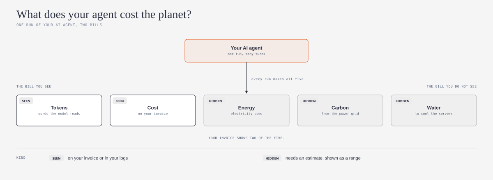
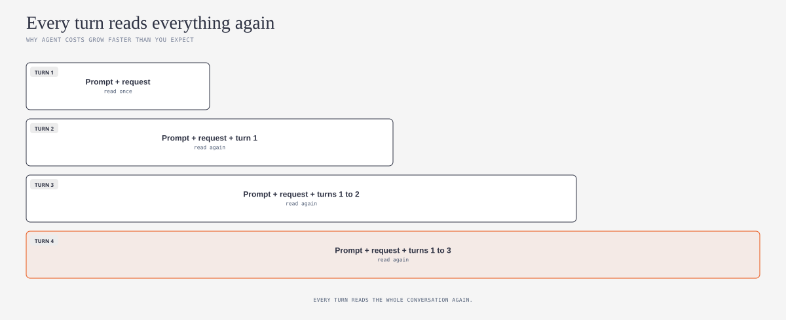
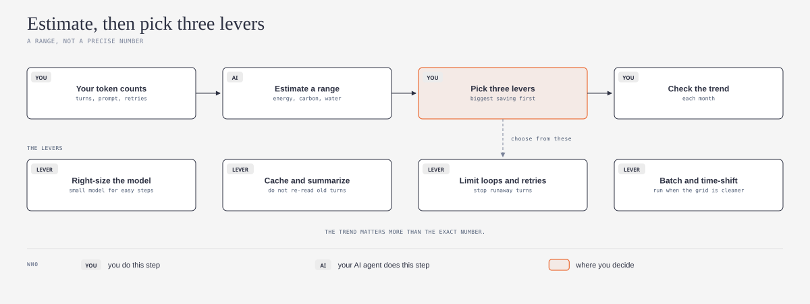

# green-agents-explained

## What is it?

This repository is a simple guide and a ready-made skill for your AI agent. Both are based on open work by the [Green Software Foundation](https://github.com/Green-Software-Foundation). The guide tells you how to estimate the energy, carbon, and water that your AI agent uses. It also tells you which changes make that footprint smaller.



*Do you want simple meanings for the technical words? Refer to the [Jargon Buster](JARGON.md).*

## What problem does it solve?

Your invoice shows tokens and money. It does not show the electricity, the carbon, or the water that each run of your agent uses. An agent is not one model call. Each turn sends the full conversation to the model again, so the footprint grows quickly. Thus, many teams do not know what their agent costs the planet, and they cannot make it smaller.

## Who is it for?

This guide is for small teams, teams that grow quickly, and solo builders who put AI agents into real work. You do not need to be a specialist in risk, cybersecurity, governance, or safety. For example, an agent that answers customers, writes code, or does research for your team. You do not need to write code to use the skill. The skill uses the open [Agent Skills](https://agentskills.io) format (`SKILL.md`), so it works with Claude, Codex, GitHub Copilot, and other AI agents that support this format.

## Safe by default

1. **Read and draft first.** The skill reads the token counts that you give it and writes drafts. It does not change your agent, your model, or your settings before you approve.
2. **Your data stays with you.** The skill does not send your prompts or logs to an outside service. It uses only the numbers that you give it.
3. **Honest numbers.** The skill shows each figure as an estimate and as a range. It does not give one exact number, and it does not say that your agent is "green".
4. **Your files stay yours.** The drafts go into your project folder. You can read, change, or delete them at any time.

## What does it do?

Ask your AI agent to estimate the footprint of your agent. The skill helps your AI agent to do these steps:

1. Collect the numbers that you already have: turns for each run, tokens, retries, the model, and runs for each week
2. Estimate a range for energy, carbon, and water, and show the assumptions
3. Find the largest cause of the footprint
4. Select three reduction levers, with the largest saving first
5. Make a plan to check the trend each month

The skill also looks for three frequent mistakes. The first mistake is to count only the tokens of the answer, and not the tokens that the model reads. The second mistake is to forget retries and long loops. The third mistake is to give one exact number when the data only supports a range.

## How does it work?

*The diagrams below use the visual language of [cathrynlavery/diagram-design](https://github.com/cathrynlavery/diagram-design):*



Each turn of an agent loop sends the standing prompt, the request, and all the earlier turns to the model again. Thus, turn four reads much more text than turn one. The Green Software Foundation calls this the compounding context loop. It is the main reason that the footprint of an agent grows faster than the number of runs.



First, you give the token counts from your logs or your invoice. Then your AI agent estimates a range, and you pick three levers. The levers come from the Green Software Foundation patterns and its agentic AI impact explorer. Each month, you do the same estimate again. The trend shows if the levers work. The exact number is less important than the trend.

Providers do not publish the energy of each request. Thus, all figures in this guide are estimates. For measured figures on supported providers, use [EcoLogits](https://github.com/mlco2/ecologits) or the [SCI for AI reference implementation](https://github.com/Green-Software-Foundation/reference-implementations/tree/main/specifications/sci-for-ai/gsf/llm-inference).

## Compare with others (planned)

I know of no public dataset that compares agents by solo builders, small teams, or country. A privacy-first benchmark can come later, if people ask for it. Each person calculates their figures on their own computer. Only weekly totals go into the benchmark, never prompts or content. The benchmark only shows groups that are large enough to keep each person anonymous.

## How to install

First, make a folder with the name `green-agent-footprint`. Put `SKILL.md` from this repository in that folder. Then do the steps for your AI agent.

### One command for all agents

If you have Node.js, run this command in a terminal. The command installs the skill for Claude Code, Codex, GitHub Copilot, and other agents.

```
npx skills add ams-builds/green-agents-explained
```

To get the latest version later, run `npx skills update`. The command uses [skills](https://github.com/vercel-labs/skills) by [Vercel](https://github.com/vercel-labs). If you do not use a terminal, use the instructions for your agent below.

### Claude

1. In claude.ai or the Claude desktop app, make a zip file of the `green-agent-footprint` folder.
2. Upload the zip file in **Settings > Capabilities > Skills**.
3. In Claude Code, put the folder in `~/.claude/skills/green-agent-footprint/`.

### Codex

1. Put the folder in `~/.agents/skills/green-agent-footprint/` for all your projects.
2. Or, put the folder in `.agents/skills/green-agent-footprint/` in one project.
3. Or, tell Codex to use `$skill-installer` with the GitHub URL of this repository.
4. If the skill does not show, start Codex again. Source: [Codex skills documentation](https://learn.chatgpt.com/docs/build-skills).

### GitHub Copilot

1. Put the folder in `~/.copilot/skills/green-agent-footprint/` for all your projects.
2. Or, put the folder in `.github/skills/green-agent-footprint/` in one repository.
3. Use Copilot in agent mode. Source: [GitHub Copilot skills documentation](https://docs.github.com/en/copilot/how-tos/copilot-cli/customize-copilot/create-skills).

These three agents are the most used AI coding agents in the [JetBrains 2026 survey](https://blog.jetbrains.com/research/2026/08/ai-coding-agent-adoption-2026/). Other agents that support Agent Skills use the same `SKILL.md` file. Refer to the documentation of your agent for the folder.

## How to use it

After you install the skill, speak to your AI agent in your usual words:

- "What does my agent cost the planet?"
- "Estimate the carbon footprint of my agent"
- "How do I make my agent use less energy?"

The skill starts automatically. You do not need to use its name.

## Other tools

These open tools give more detail. This guide does not install them.

1. [Agentic AI impact explorer](https://github.com/Green-Software-Foundation/reference-implementations/tree/main/tools/gsf/agentic-ai-impact-explorer): a calculator in your browser for the cost, energy, carbon, and water of an agent.
2. [Green code skill](https://github.com/Green-Software-Foundation/reference-implementations/tree/main/tools/gsf/green-code-skill): an agent skill that reviews code against green software patterns.
3. [mcp-sci](https://github.com/Green-Software-Foundation/reference-implementations/tree/main/tools/gsf/mcp-sci): a prototype that lets a tool tell your agent the energy and carbon of each call.
4. [EcoLogits](https://github.com/mlco2/ecologits) by [GenAI Impact](https://github.com/genai-impact) and [CodeCarbon](https://github.com/mlco2/codecarbon): libraries that measure or estimate energy in code.
5. [Impact Framework](https://github.com/Green-Software-Foundation/if), [Carbon Aware SDK](https://github.com/Green-Software-Foundation/carbon-aware-sdk), and the [software water handbook](https://github.com/Green-Software-Foundation/software-water-handbook) from the Green Software Foundation.

## Credit and license

This guide is based on open work by the [Green Software Foundation](https://github.com/Green-Software-Foundation):

1. [Reference implementations](https://github.com/Green-Software-Foundation/reference-implementations), commit `122780c` (2 September 2026), MIT License. Mainly the agentic AI impact explorer and the SCI for AI LLM inference implementation.
2. The [SCI for AI specification](https://sci-for-ai.greensoftware.foundation/) ([repository](https://github.com/Green-Software-Foundation/sci-ai), commit `e8d3534`). This guide only describes and links the specification. It does not copy its text.
3. [Green Software Patterns](https://github.com/Green-Software-Foundation/patterns), commit `36ccf75`, CC BY 4.0. The levers adapt ideas from four patterns by [Navveen Balani](https://github.com/navveenb). Refer to [NOTICE](NOTICE) for the list.

This repository uses the MIT License. Refer to [LICENSE](LICENSE) and [NOTICE](NOTICE).

This is an independent guide. It is not an official part of the Green Software Foundation, and the Foundation did not review it.

Changes from the sources:

1. I wrote the main concepts again in Simplified Technical English, for readers who are not specialists.
2. I made three new diagrams.
3. I wrote an agent skill that helps one person estimate the footprint of one agent.
4. I did not copy code, figures, or the specification text. The skill refers to the sources by their file paths and links.

**Language.** I wrote the text in Simplified Technical English (ASD-STE100). The idea to ask an AI model to write in ASD-STE100 comes from [Andrej Karpathy](https://github.com/karpathy) ([his post on X](https://x.com/karpathy/status/2105819303471976479)). I used the [simplified-technical-english](https://github.com/0xpili/simplified-technical-english) agent skill by [pili](https://github.com/0xpili) to write and check the text. ASD-STE100 is a specification of ASD (AeroSpace and Defence Industries Association of Europe). This repository is not related to ASD.

---

*New words? The [Jargon Buster](JARGON.md) gives simple meanings for carbon intensity, embodied carbon, SCI, reduction lever, water footprint, and more.*
